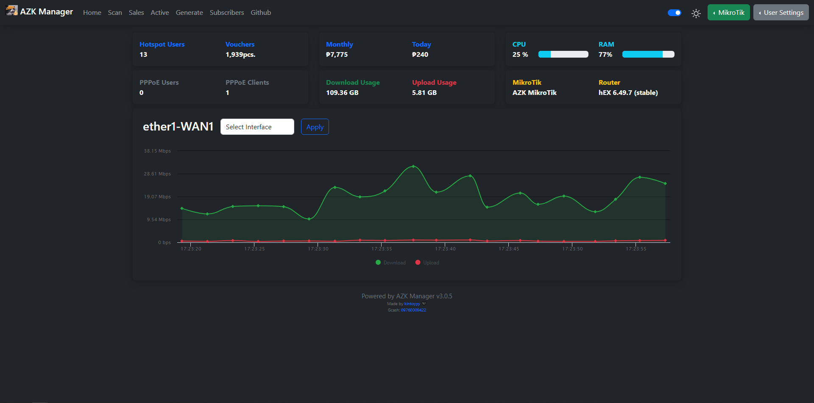

# **JuanFi Manager**

### **Features:** 
- Voucher Generation Using API
- Basic JuanFi Dashboard
- Reseller/Vendo Sales Report and Charts
- Seller Customizations
- Custom Currency 
### **Tested only on RouterOS v6.4x.xx**
### **Docker support soon!**

# **Screenshots**
### - **Login Page**

### - **Main Dashboard**

### - **Printing page**
#### Right click to print

### - **Telegram report**

# **1. Setup**
## Edit the config file first
### **[config/config.php](/config/config.php)**
    //Database credentials (no need to edit this unless you know what you are doing)
    define('DB_SERVER', 'localhost');       //Datebase location, default: localhost
    define('DB_USERNAME', 'root');          //Datebase username
    define('DB_PASSWORD', '');              //Datebase Password
    define('DB_NAME', 'JuanFi');            //Datebase name
    define('DB_PORT', '3306');              //Datebase port Default, default: 3306

    // Mikrotik credentials
    define('MT_SERVER', '10.0.0.1');        //Mikrotik IP
    define('MT_USERNAME', 'User');          //Mikrotik Username
    define('MT_PASSWORD', 'Passord');       //Mikrotik Password
    define('MT_PORT', '8728');              //Mikrotik port

    //Settings
    $CURRENCY = '₱';                        //Currency
    $INTERFACE = "ether-1";                 //Interface Data Usage, don't forget to set this to avoid errors
    $REFRESH = 15000;                       //Topstats refreshh 15000 = 15sec
    $SHARE = 50;                            //Max 100, examples: 70=70%, 50=50%

# **2. Setting up the server**

## Install and run **[XAMPP](https://www.apachefriends.org/)** server
### - Start the **Apache** And **MySQL** servers

### - Click the **Admin** button of MySQL to access the phpmyadmin

### - Click on **New** and **Create** database, name it **JuanFi**

### - Select the **Juanfi** database and import the **[users.sql](/config/users.sql)**

##### note: wala akong alam sa DB, para sa user at password lang to :>
#### :added database for future updates for the app

# **3. Add the files to the htdocs Folder**
### - Select all the files in this repository

### - remove all the files in the **[htdocs](C:\xampp\htdocs)** folder located inside **C:\xampp\htdocs** and paste the files inside

# **4. Setup Mikrotik**
### add the **on login** and **on logout** script in to your hotspot profile in order for the dashboard to display the informations

## **On login Script**
    ### enable telegram notification, change from 0 to 1 if you want to enable telegram
    :local enableTelegram 1;
    ###replace telegram token
    :local telegramToken "xxxxxxx:XXXXXXXXXXXXXXXXXXXXXXXXXXXXX";
    ###replace telegram chat id / group id
    :local chatId "-xxxxxxxx";
    ### enable Random MAC synchronizer
    :local enableRandomMacSyncFix 1;
    ### hotspot folder for HEX put flash/hotspot for haplite put hotspot only
    :local hotspotFolder "flash/hotspot";

    :local com [/ip hotspot user get [find name=$user] comment];
    /ip hotspot user set comment="" $user;

    :if ($com!="") do={

        :local mac $"mac-address";
        :local macNoCol;
        :for i from=0 to=([:len $mac] - 1) do={ 
        :local char [:pick $mac $i]
        :if ($char = ":") do={
            :set $char ""
        }
        :set macNoCol ($macNoCol . $char)
        }
        
        :local validity [:pick $com 0 [:find $com ","]];
        
        :if ( $validity!="0m" ) do={
            :local sc [/sys scheduler find name=$user]; :if ($sc="") do={ :local a [/ip hotspot user get [find name=$user] limit-uptime]; :local c ($validity); :local date [ /system clock get date]; /sys sch add name="$user" disable=no start-date=$date interval=$c on-event="/ip hotspot user remove [find name=$user]; /ip hotspot active remove [find user=$user]; /ip hotspot cookie remove [find user=$user]; /system sche remove [find name=$user]; /file remove \"$hotspotFolder/data/$macNoCol.txt\";" policy=ftp,reboot,read,write,policy,test,password,sniff,sensitive,romon; :delay 2s; } else={ :local sint [/sys scheduler get $user interval]; :if ( $validity!="" ) do={ /sys scheduler set $user interval ($sint+$validity); } };
        }
        
        :local infoArray [:toarray [:pick $com ([:find $com ","]+1) [:len $com]]];
        
        :local totaltime [/ip hotspot user get [find name="$user"] limit-uptime];
        :local amt [:pick $infoArray 0];
        :local ext [:pick $infoArray 1];
        :local vendo [:pick $infoArray 2];
        :local uactive [/ip hotspot active print count-only];
        
        :local getIncome [:put ([/system script get [find name=todayincome] source])];
        /system script set source="$getIncome" todayincome;

        :local getSales ($amt + $getIncome);
        /system script set source="$getSales" todayincome;

        :local getMonthlyIncome [:put ([/system script get [find name=monthlyincome] source])];
        /system script set source="$getMonthlyIncome" monthlyincome;

        :local getMonthlySales ($amt + $getMonthlyIncome);
        /system script set source="$getMonthlySales" monthlyincome;

        :if ( [/system script find name=$vendo] != "" ) do={ 
                :local getVendorScript [/system script get [find name=$vendo] comment];:local vendorArray [:toarray [:pick $getVendorScript ([:find $getVendorScript ","]) [:len $getVendorScript]]];:local getMontlhySales [:pick $vendorArray 0];:local getLastSales [:pick $vendorArray 1];:local addMonthly ($amt + $getMontlhySales);:local getSellerIncome [:put ([/system script get [find name=$vendo] source])];:local getSellerSales ($amt + $getSellerIncome);/system script set source="$getSellerSales" comment="VendoSales,$addMonthly,$getLastSales" $vendo;
                :if ($enableTelegram=1) do={/tool fetch url="https://api.telegram.org/bot$telegramToken/sendmessage?chat_id=$chatId&text=<<======New Sales======>> %0A Seller: $vendo %0A Seller Sales : $getSellerSales %0A Seller Montly Sales : $addMonthly %0A Voucher: $user %0A IP: $address %0A MAC: $mac %0A Amount: $amt %0A Extended: $ext %0A Total Time: $totaltime %0A  %0A Today Sales : $getSales %0A Monthly Sales : $getMonthlySales %0A Active Users: $uactive%0A <<=====================>>" keep-result=no;};
            } else={ 
                :local comment "VendoSales,$amt,0";/system script add name=$vendo owner=admin comment=$comment source="$amt";/system scheduler add interval=4w2d name="Reset $vendo Income" on-event=":local getVendorScript [/system script get [find name=$vendo] comment];:local vendorArray [:toarray [:pick \$getVendorScript ([:find \$getVendoScript \",\"]) [:len \$getVendorScript]]];:local getLastSales [:pick \$vendorArray 1];/system script set [find name=$vendo] comment=\"VendoSales,0,\$getLastSales\";"  start-date=sep/01/2022 start-time=00:00:00;
        }

        :local validUntil [/system scheduler get $user next-run];

        /file print file="$hotspotFolder/data/$macNoCol" where name="dummyfile"; 
        :delay 1s; 
        /file set "$hotspotFolder/data/$macNoCol" contents="$user#$validUntil";
    };

    :if ($enableRandomMacSyncFix=1) do={
        :local cmac $"mac-address"
        :foreach AU in=[/ip hotspot active find user="$username"] do={
        :local amac [/ip hotspot active get $AU mac-address];
        :if ($cmac!=$amac) do={  /ip hotspot active remove [/ip hotspot active find mac-address="$amac"]; }
        }
    }
    
## Optional onlogin script with With [Genman](https://genman.projectdorsu.com/) online juanfi sales API

### [Genman-api-script](config/genman-api.md)

## **On logout Script**

    ### hotspot folder for HEX put flash/hotspot for haplite put hotspot only
    :local hotspotFolder "flash/hotspot";

    :local mac $"mac-address";
    :local macNoCol;
    :for i from=0 to=([:len $mac] - 1) do={ 
    :local char [:pick $mac $i]
    :if ($char = ":") do={
        :set $char ""
    }
    :set macNoCol ($macNoCol . $char)
    }
        
    :if ([/ip hotspot user get [/ip hotspot user find where name="$user"] limit-uptime] <= [/ip hotspot user get [/ip hotspot user find where name="$user"] uptime]) do={
        /ip hotspot user remove $user;
        /file remove "$hotspotFolder/data/$macNoCol.txt";
        /system sche remove [find name=$user];
    }

## **Scheduler Script**
    /system scheduler add interval=1d name="Reset Daily Income" on-event="/system script set source=\"0\" todayincome " policy=ftp,reboot,read,write,policy,test,password,sniff,sensitive,romon start-date=Sep/28/2021 start-time=00:00:00;
    /system scheduler add interval=30d name="Reset Monthly Income" on-event="/system script set source=\"0\" monthlyincome " policy=ftp,reboot,read,write,policy,test,password,sniff,sensitive,romon start-date=Sep/28/2021 start-time=00:00:00;
    /system script add dont-require-permissions=no name=todayincome owner=admin policy=ftp,reboot,read,write,policy,test,password,sniff,sensitive,romon source="0";
    /system script add dont-require-permissions=no name= monthlyincome owner=admin policy=ftp,reboot,read,write,policy,test,password,sniff,sensitive,romon source="0";

# **5. Done Congrats!**
## You can now access the **dashboard** using the **admin** button or typing **[localhost](http://localhost/)** in your browser

    Username: admin
    Password: admin123
    //you can change this on the reset password page

    Note:If you screen is blank please create a dummy hotspot user
    
    name:dummy
    pass:blank
    Profile:default
    comment:0m,0,0,JuanFi

> ## **This Voucher Generator/manager Only works for [ivanalayan15/JuanFi](https://github.com/ivanalayan15/JuanFi) system**

> - ### Facebook Community: https://www.facebook.com/groups/1172413279934139
> - JuanFi is an open source system for coinslot integration for mikrotik hotspot
> - Donation is very welcome, you can donate to juanfi system developer.
> - Gcash account: Ivan Julius Alayan 09175425572
> - Paypal account: https://www.paypal.com/paypalme/ivanalayan

    Made by Kintoyyy :)
    Gcash account: Kent R. 09760009422
    FB: @kint.oyyy508
