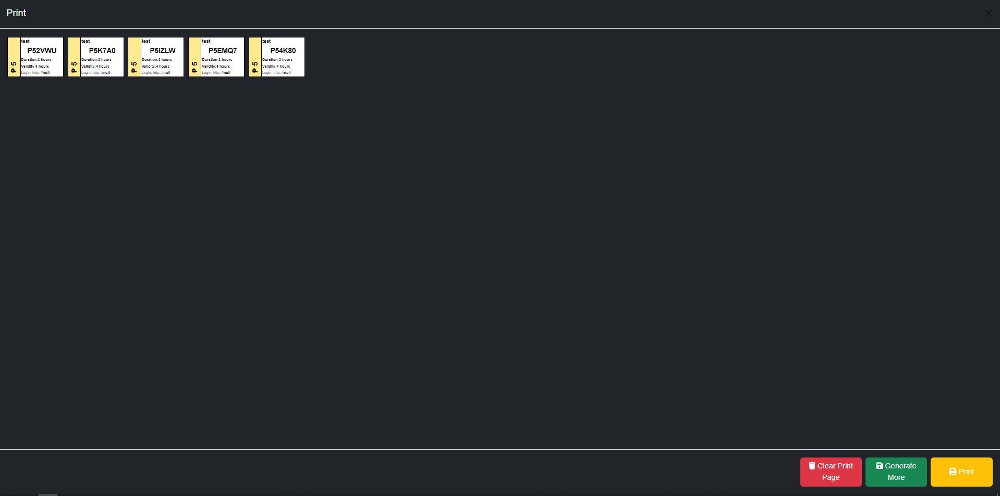

# **JuanFi Manager**

    Made by Kintoyyy :)
    FB: @kint.oyyy508

    Donations would be appreciated
    Gcash/Paymaya account: Kent R. 09760009422
    Paypal account: https://www.paypal.com/paypalme/Kintoyyyy
    

# **View Preview Page**

## **[Preview Here](https://kintoyyy.github.io/AZK-Manager/example/main.html)**

### **Features:** 
- Voucher Generation Using API
- JuanFi Dashboard
- Resellers Dashboard
- Reseller/Vendo Sales Report and Charts
- Seller Customizations
- Custom Currency 
- Qr Code scanner
- Hotspot Subscribers
- Proper Darkmode
### **Tested only on RouterOS v6.4x.xx**
### **Run using Docker**
    docker compose up

# **Screenshots**
### - **Login Page**

### - **Main Dashboard**

### - **Voucher Reseller Dashboard**

### - **Printing page**
#### Click View print page

### - **Telegram report**

### - **Subscribers report**

# **1. Add the files to the htdocs Folder**
### - Select all the files in this repository

### - remove all the files in the **[htdocs](C:\xampp\htdocs)** folder located inside **C:\xampp\htdocs** and paste the files inside

# **2. Setting up the server**
## Install and run **[XAMPP](https://www.apachefriends.org/)** server
### - Start the **Apache** server (**no need MySQL**)

# **3. Setup Mikrotik**
### add the **on login** and **on logout** script in to your hotspot profile in order for the dashboard to display the informations

## **On login Script**
    ### enable telegram notification, change from 0 to 1 if you want to enable telegram
    :local enableTelegram 1;
    ###replace telegram token
    :local telegramToken "xxxxxxxxxxxxxxxxxxxxxxxxxxxxxxxxxxxx";
    ###replace telegram chat id / group id
    :local chatId "xxxxxxxxxxxxx";
    ### enable Random MAC synchronizer
    :local enableRandomMacSyncFix 1;
    ### hotspot folder for HEX put flash/hotspot for haplite put hotspot only
    :local hotspotFolder "flash/Hotspot";

    :local com [/ip hotspot user get [find name=$user] comment];
    /ip hotspot user set comment="" $user;

    :if ($com!="") do={

	:local mac $"mac-address";
	:local macNoCol;
	:for i from=0 to=([:len $mac] - 1) do={ 
	  :local char [:pick $mac $i]
	  :if ($char = ":") do={
		:set $char ""
	  }
	  :set macNoCol ($macNoCol . $char)
	}
	
	:local validity [:pick $com 0 [:find $com ","]];
	
	:if ( $validity!="0m" ) do={
		:local sc [/sys scheduler find name=$user]; :if ($sc="") do={ :local a [/ip hotspot user get [find name=$user] limit-uptime]; :local c ($validity); :local date [ /system clock get date]; /sys sch add name="$user" disable=no start-date=$date interval=$c on-event="/ip hotspot user remove [find name=$user]; /ip hotspot active remove [find user=$user]; /ip hotspot cookie remove [find user=$user]; /system sche remove [find name=$user]; /file remove \"$hotspotFolder/data/$macNoCol.txt\";" policy=ftp,reboot,read,write,policy,test,password,sniff,sensitive,romon; :delay 2s; } else={ :local sint [/sys scheduler get $user interval]; :if ( $validity!="" ) do={ /sys scheduler set $user interval ($sint+$validity); } };
	}
	
	:local infoArray [:toarray [:pick $com ([:find $com ","]+1) [:len $com]]];
	
	:local totaltime [/ip hotspot user get [find name="$user"] limit-uptime];
	:local amt [:pick $infoArray 0];
	:local ext [:pick $infoArray 1];
	:local vendo [:pick $infoArray 2];
	:local uactive [/ip hotspot active print count-only];
	
	:local getIncome [:put ([/system script get [find name=todayincome] source])];
	/system script set source="$getIncome" todayincome;

	:local getSales ($amt + $getIncome);
	/system script set source="$getSales" todayincome;

	:local getMonthlyIncome [:put ([/system script get [find name=monthlyincome] source])];
	/system script set source="$getMonthlyIncome" monthlyincome;

	:local getMonthlySales ($amt + $getMonthlyIncome);
	/system script set source="$getMonthlySales" monthlyincome;

	:if ( [/system script find name=$vendo] != "" ) do={ 
			:local getVendorScript [/system script get [find name=$vendo] comment];
			:local vendorArray [:toarray [:pick $getVendorScript ([:find $getVendorScript ","]) [:len $getVendorScript]]];
			:local getMontlhySales [:pick $vendorArray 0];
            :local getDailySales [:pick $vendorArray 2];
			:local getLastSales [:pick $vendorArray 1];
			:local addMonthly ($amt + $getMontlhySales);
            :local addDaily ($amt + $getDailySales);
			:local getSellerIncome [:put ([/system script get [find name=$vendo] source])];
			:local getSellerSales ($amt + $getSellerIncome);
			/system script set source="$getSellerSales" comment="VendoSales,$addMonthly,$getLastSales,$addDaily" $vendo;
			:if ($enableTelegram=1) do={/tool fetch url="https://api.telegram.org/bot$telegramToken/sendmessage?chat_id=$chatId&text=<<======New Sales======>> %0A Seller: $vendo %0A Sales : $getSellerSales %0A Montly Sales : $addMonthly %0A Daily Sales : $addDaily %0A Voucher: $user %0A IP: $address %0A MAC: $mac %0A Amount: $amt %0A Extended: $ext %0A Total Time: $totaltime %0A  %0A Total Today Sales : $getSales %0A Total Monthly Sales : $getMonthlySales %0A Active Users: $uactive%0A <<=====================>>" keep-result=no;};
		} else={ 
			:local comment "VendoSales,$amt,0,0";
			/system script add name=$vendo owner=admin comment=$comment source="$amt";
	}

	:local validUntil [/system scheduler get $user next-run];

	/file print file="$hotspotFolder/data/$macNoCol" where name="dummyfile"; 
	:delay 1s; 
	/file set "$hotspotFolder/data/$macNoCol" contents="$user#$validUntil";
    };

    :if ($enableRandomMacSyncFix=1) do={
	:local cmac $"mac-address"
	:foreach AU in=[/ip hotspot active find user="$username"] do={
	  :local amac [/ip hotspot active get $AU mac-address];
	  :if ($cmac!=$amac) do={  /ip hotspot active remove [/ip hotspot active find mac-address="$amac"]; }
	}
    }
    
## **or if you have a custom juanfi onlogin script insert the script**

	### Azk Manager Script

		:if ( [/system script find name=$vendo] != "" ) do={ 
			:local getVendorScript [/system script get [find name=$vendo] comment];
			:local vendorArray [:toarray [:pick $getVendorScript ([:find $getVendorScript ","]) [:len $getVendorScript]]];
			:local getMontlhySales [:pick $vendorArray 0];
		:local getDailySales [:pick $vendorArray 2];
			:local getLastSales [:pick $vendorArray 1];
			:local addMonthly ($amt + $getMontlhySales);
		:local addDaily ($amt + $getDailySales);
			:local getSellerIncome [:put ([/system script get [find name=$vendo] source])];
			:local getSellerSales ($amt + $getSellerIncome);
			/system script set source="$getSellerSales" comment="VendoSales,$addMonthly,$getLastSales,$addDaily" $vendo;
		} else={ 
			:local comment "VendoSales,$amt,0,0";
			/system script add name=$vendo owner=admin comment=$comment source="$amt";
		};

	### End Azk Manager Script
    

## **On logout Script**

    ### hotspot folder for HEX put flash/hotspot for haplite put hotspot only
    :local hotspotFolder "flash/hotspot";

    :local mac $"mac-address";
    :local macNoCol;
    :for i from=0 to=([:len $mac] - 1) do={ 
    :local char [:pick $mac $i]
    :if ($char = ":") do={
        :set $char ""
    }
    :set macNoCol ($macNoCol . $char)
    }
	
    :if ([/ip hotspot user get [/ip hotspot user find where name="$user"] limit-uptime] <= [/ip hotspot user get [/ip hotspot user find where name="$user"] uptime]) do={
    /ip hotspot user remove $user;
	/file remove "$hotspotFolder/data/$macNoCol.txt";
	/system sche remove [find name=$user];
    }   

## **Scheduler Script (paste in  terminal)**
    /system scheduler add comment="Reset Daily Income" interval=1d name="Reset Daily Income" on-event="/system script set source=\"0\" todayincome; /system script :foreach i in=[find] do={ :if ([get \$i comment]~\"VendoSales\") do={ :local getVendorScript [/system script get \$i comment]; :local vendorArray [:toarray [:pick \$getVendorScript ([:find \$getVendoScript \",\"]+1) [:len \$getVendorScript]]];:local getLastSales [:pick \$vendorArray 2];:local getMonthlySales [:pick \$vendorArray 1];/system script set \$i comment=\"VendoSales,\$getMonthlySales,\$getLastSales,0\";}}" policy=ftp,reboot,read,write,policy,test,password,sniff,sensitive,romon start-date=sep/28/2021 start-time=00:00:00
    /system scheduler add comment="Reset Monthly Income" interval=4w3d name="Reset Monthly Income" on-event="/system script set source=\"0\" monthlyincome; /system script :foreach i in=[find] do={ :if ([get \$i comment]~\"VendoSales\") do={ :local getVendorScript [/system script get \$i comment]; :local vendorArray [:toarray [:pick \$getVendorScript ([:find \$getVendoScript \",\"]+1) [:len \$getVendorScript]]]; :local getLastSales [:pick \$vendorArray 2]; /system script set \$i comment=\"VendoSales,0,\$getLastSales\"; }}" policy=ftp,reboot,read,write,policy,test,password,sniff,sensitive,romon start-date=aug/01/2022 start-time=00:00:00

    /system script add dont-require-permissions=no name=todayincome owner=admin policy=ftp,reboot,read,write,policy,test,password,sniff,sensitive,romon source="0";
    /system script add dont-require-permissions=no name= monthlyincome owner=admin policy=ftp,reboot,read,write,policy,test,password,sniff,sensitive,romon source="0";

## **Create a scheduler with 1d interval and paste the script**
    ###replace telegram token
    :local telegramToken "xxxxxxxxxxxxxxxxxxxxxxxxxxxxxxxxxxxx";
    ###replace telegram chat id / group id
    :local chatId "xxxxxxxxxxxxx";

    /ip hotspot user
    ## Get Date Today
    :local LocalDate [/system clock get date];
    :local Day [:pick $LocalDate ([:find $LocalDate "/" -1] + 1) [:find $LocalDate "/" [:find $LocalDate "/" -1]]]
    ##Format Date 1 - 31
    :global FormatDate do={
    :if ($d > 31) do={
    :return ($d - 31);
    } else={ 
    :return ($d);
    }
    };
    ## Scan Hotspot users
    :foreach i in=[find] do={
        :local com [/ip hotspot user get $i comment];
        :local infoArray [:toarray [:pick $com ([:find $com ","]+1) [:len $com]]];
        :if ([get $i comment]~"unpaid" && ($Day+0) = [$FormatDate d=([:pick $infoArray 0]+3)] && "false" = [/ip hotspot user get $i disabled]) do={
            /ip hotspot user set $i disabled=yes;
            :local name [/ip hotspot user get $i name];
    /ip hotspot active remove [find user=$name];
    /ip hotspot cookie remove [find user=$name]; 
            :local price [:pick $infoArray 1];
            :local contact [:pick $infoArray 3];
            :local fb [:pick $infoArray 4];
            :tool fetch url="https://api.telegram.org/bot$telegramToken/sendmessage?chat_id=$chatId&text=[Over Due Subscriber Disconnected]%0A%0A Name: $name %0A Price: $price %0A Contact: $contact %0A Facebook: m.me/@$fb" keep-result=no;
            :log warning ("Subscriber Logs - Disabled Overdue: " . $name . " - due date: $LocalDate");
        }
        :if ([get $i comment]~"paid" && ($Day+0) = [:pick $infoArray 0] && "false" = [/ip hotspot user get $i disabled]) do={
            :local name [/ip hotspot user get $i name];
            :local date [:pick $infoArray 0];
            :local price [:pick $infoArray 1];
            :local contact [:pick $infoArray 3];
            :local fb [:pick $infoArray 4];
            /ip hotspot user set $i comment="subscriber,$date,$price,unpaid,$contact,$fb";
    :tool fetch url="https://api.telegram.org/bot$telegramToken/sendmessage?chat_id=$chatId&text=[Changed to unpaid Subscriber]%0A%0A Name: $name %0A Price: $price %0A Contact: $contact %0A Facebook: m.me/@$fb" keep-result=no;
            :log warning ("Subscriber Logs - Changed : " . $name . " - $date - $price - unpaid - $contact - $fb");
        }
    }

# **4. Done Congrats!**
## You can now access the **dashboard** using the **admin** button or typing **[localhost](http://localhost/)** in your browser

    Username: Admin
    Password: admin123
    //you can change this on the reset password page

> ## **This Voucher Generator/manager Only works for [ivanalayan15/JuanFi](https://github.com/ivanalayan15/JuanFi) system**

> - ### Facebook Community: https://www.facebook.com/groups/1172413279934139
> - JuanFi is an open source system for coinslot integration for mikrotik hotspot

